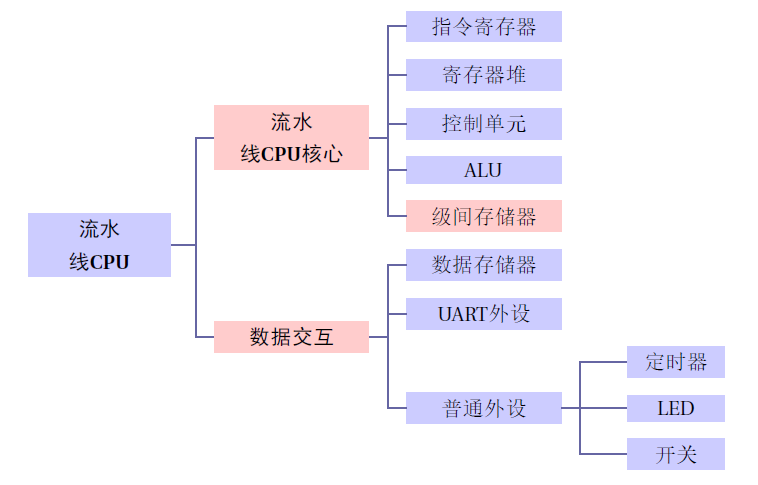
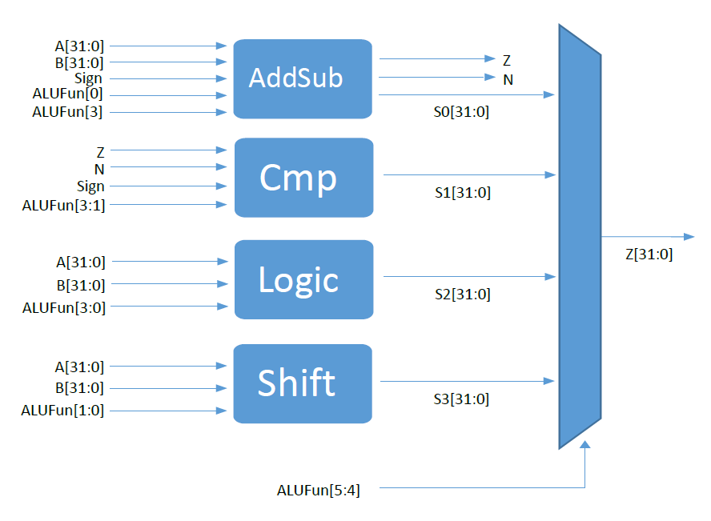
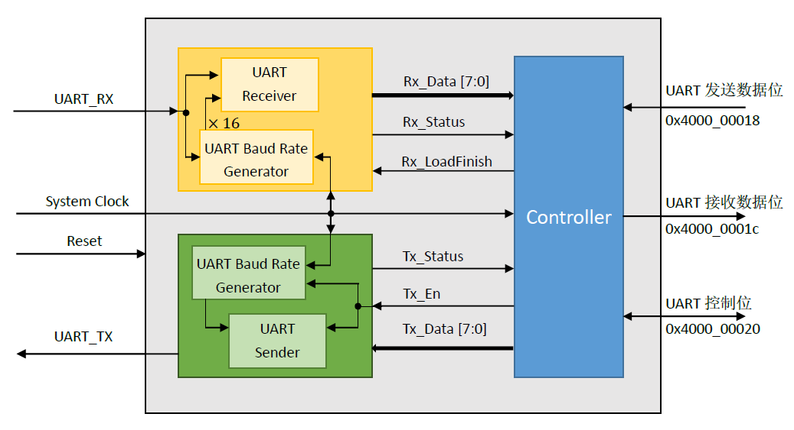
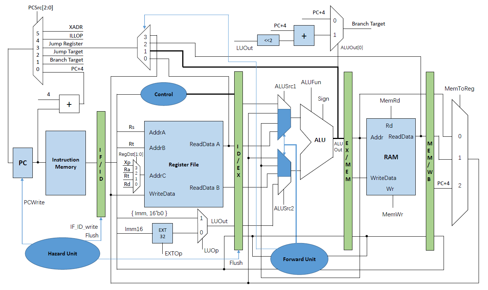

32-Bit MIPS CPU (Classic RISC Pipeline)
==================
(Latest update: 2016/07/30)

整体设计
--------

我们将CPU分为如下功能单元：指令存储器、寄存器堆、控制单元、ALU、数据存储器、UART外设、普通外设、转发单元(流水线CPU)、冒险单元(流水线CPU)等。在CPU模块中实例化各功能单元，建立数据通路。整体设计框架如图，蓝色模块为通用模块，红色模块为流水线CPU新增模块。

ALU
---

ALU模块分为四个子模块，分别是加减运算模块，比较模块，逻辑模块和移位模块，通过ALUFun最高两位多路选择，决定最后的输出。详细的模块设计如图所示。

对于加减法模块，我们通过实验发现如果采用超前进位加法，可以使得ALU模块的组合逻辑延时更小，但是当使用超前进位模块的ALU放入流水线CPU进行整体综合时，反而会使得流水线的工作频率降低。这可能是由于quartus在综合流水线的时候自身的优化机制可以使得直接使用加号和减号进行运算的方式优化的更好，因此我们最后没有采用超前进位而是直接使用A+B和A-B的方式来实现加减法计算。

对于移位模块，我们通过实验发现直接采用“&lt;&lt;”和“&gt;&gt;”运算符的方式可以让流水线的频率更高。因此最后没有采用实验指导书上的1，2，4，8位移位串联的方式。

对于最后的四路选择（选择输出的结果是采用四个模块中哪一个的结果），我们发现由于各个模块的组合逻辑延时不同，调换各个模块之间的顺序使得延时长的模块先被分支出执行可以使得最长的组合逻辑通路变短，因此我们最后通过实验改变条件运算的先后次序，使得ALU的最大延时变短。

对于另外一些组合逻辑的运算，我们发现有时相同语义的语句采用不同的写法会影响组合逻辑的延时。例如当判断A是否为0时，我们采用A的所有位做或运算(|A)可以比直接判断A是否等于0(A==0)更快。另外，条件运算符冒号两侧是固定的数值时运算比两侧是逻辑表达式要快（这可能是由于FPGA内部结构是查找表造成的）。例如，假设a，b，c是三个一位二进制数，
对于以下两行代码

        assign a = b ? c : ~c;
        assign a = (b & c) ? 1 : 0; 
        

第一行代码执行需要的延时就比第二行代码要大。

根据以上这几条规律，我们对ALU的代码进行优化以提升流水线CPU的时钟频率。

数据交互模块
------------

### 寄存器堆

使用 reg\[31:0\] RF\_DATA\[31:0\]
实现。同时，寄存器堆初始化时包括\$0，使用判断语句来控制寄存器的写入，即保证\$0其值只为0。在流水线CPU中，为保证读写正确，我们令寄存器堆在时钟下降沿时写入。这样，在读取寄存器数据时不做判断，就减少读取的组合逻辑；同时由于\$0不可被改变，因此各单元内是否写入\$0的判断均可删去，简化逻辑。

### UART外设

UART串口收发模块采用春季学期第四次实验代码实现，其数据通路如图。UART控制模块在UART接收模块产生接收完成信号脉冲Rx\_Status时，置位UART外设存储器的控制数据相应位(接收中断控制位)，同时返回信号Rx\_LoadFinish指示UART控制模块结束信号Rx\_Status；UART控制模块在写入UART外设存储器的发送地址后，将产生发送使能信号Tx\_En给UART发送模块；读取UART外设存储器的控制数据后，将复位其接收中断状态位、发送中断状态位。

流水线CPU数据通路
-----------------

### 转发单元

**ForwardA | ForwardB**

最常见的冒险来自EX段，也就是ALU的操作数需要用到上一条或者倒数第二条的指令时可能产生的冒险，即有可能用到EX/MEM寄存器内的数据，或者是MEM/WB寄存器内的数据，判定伪码如下：

EX/MEM
段的转发需要判定的是前一条指令写入非\$0寄存器，且写入地址与需要读取的地址相等

        if ( EX/MEM.RegWrite
        and ( EX/MEM.RegisterRd != 0 )
        and ( EX/MEM.RegisterRd == ID/EX.RegisterRs ))
        ForwardA = 10
        

MEM/WB 段的转发需要增加一个判定，就是要求不能从EX/MEM就近转发

        if ( MEM/WB.RegWrite
        and ( MEM/WB.RegisterRd != 0 )
        and not ( EX/MEM.RegWrite and (EX/MEM.RegisterRd != 0 ) 
            and ( EX/MEM.RegisterRd != ID/EX.RegisterRd ))
        and ( MEM/EX.RegisterRd == ID/EX.RegisterRs ))
        ForwardA = 01
        

将上述的Rs全部改为Rt就得到了ForwardB的转发条件，verilog代码如下。

先获得控制信号

        // ForwardA, strategy here same as the textbook
        if(EX_MEM_RegWrite && EX_MEM_AddrC != 5'h00
            && EX_MEM_AddrC == ID_EX_Rs) begin
            ForwardA = 2'b10;
        end
        else if(MEM_WB_RegWrite && MEM_WB_AddrC != 5'h00
            && MEM_WB_AddrC == ID_EX_Rs) begin
            ForwardA = 2'b01;
        end
        else 
            ForwardA = 2'b00;
        // Only replace Rt with Rs of ForwardA and we get ForwardB
        

根据控制信号选择前传的数据

        assign ForwardAData = (ForwardA==2'b00) ? EX_DataBusA : 
            (ForwardA==2'b01) ? WB_DataBusC : MEM_ALUOut;
        assign ForwardBData = (ForwardB==2'b00) ? EX_DataBusB : 
            (ForwardB==2'b01) ? WB_DataBusC : MEM_ALUOut;
        assign ForwardJData = (ForwardJ == 2'b00) ? ID_DataBusA : 
            (ForwardJ == 2'b01) ? EX_ALUOut :
            (ForwardJ == 2'b10) ? WB_MemReadData : WB_DataBusC;
        

**ForwardJ**

注意到当我们的CPU中增加了jr指令的支持后，ID段也是有可能需要转发的，这使得我们在教材的基础上增加了ForwardJ信号，用于前向转发jr指令需要的寄存器值。此时转发可能来自ID/EX，EX/MEM，MEM/WB三个寄存器。如果检测到jr指令跳转位置的寄存器号与ID/EX段的写入寄存器相同，那么需要从ALUOut转发；如果和EX/MEM段的写入寄存器相同，那需要从ReadData处转发；若同MEM/WB的写入寄存器相同，那就转发将要写回的DatabusC。

        if ( ID.PCSrc == 3 && ID/EX.RegWrite 
        and ( ID/EX.RegisterRd != 0 )
        and ( ID/EX.RegisterRd == IF/ID.Rs))
            ForwardJ = 01
        

        if ( ID.PCSrc == 3 && EX/MEM.RegWrite 
        and ( EX/MEM.RegisterRd != 0 )
        and ( EX/MEM.RegisterRd == IF/ID.Rs))
            ForwardJ = 10
        

        if ( ID.PCSrc == 3 && MEM/WB.RegWrite 
        and ( MEM/WB.RegisterRd != 0 )
        and ( MEM/WB.RegisterRd == IF/ID.Rs))
            ForwardJ = 11
        

verilog代码如下。先生成控制信号

        // Forward strategy for JR
        if(ID_PCSrc == 3'b011 && ID_EX_RegWrite && ID_EX_AddrC != 5'h00
            && ID_EX_AddrC == IF_ID_Rs) begin
            ForwardJ = 2'b01;
        end
        else if(ID_PCSrc == 3'b011 && EX_MEM_RegWrite && EX_MEM_AddrC != 5'h00
            && EX_MEM_AddrC == IF_ID_Rs) begin
            ForwardJ = 2'b10;
        end
        else if(ID_PCSrc == 3'b011 && MEM_WB_RegWrite && MEM_WB_AddrC != 5'h00
            && MEM_WB_AddrC == IF_ID_Rs) begin
            ForwardJ = 2'b11;
        end
        else
            ForwardJ = 2'b00;
        
        

根据控制信号选择前传的数据

        assign ForwardJData = (ForwardJ == 2'b00) ? ID_DataBusA : 
            (ForwardJ == 2'b01) ? EX_ALUOut :
            (ForwardJ == 2'b10) ? WB_MemReadData : WB_DataBusC;
        

### 冒险单元

冒险检测单元主要解决load-use，beq类指令和jump类指令的三种冒险。为了实现冒险控制，我们添加PC.write和IF/ID.write两个寄存器写入控制信号和IF/ID.flush和ID/EX.flush两个寄存器清空的控制信号。其中只有write信号为1时对应寄存器在上升沿才能被写入新值，一旦flush信号取1，时钟上升沿时直接清空整个寄存器。我们通过这四个控制信号完成冒险控制。

**load-use**

当ID/EX段发现是load指令，且读取寄存器号与下一条指令的将要读取的寄存器号相同时，CPU知道会触发load-use冒险，这意味着下一条必须stall一个周期，即我们要禁止PC、IF/ID寄存器的写入，同时下个上升沿到来后的ID/EX内的指令是不能用的，应该flush掉。伪码如下:

        if ( ID/EX.MemRead && ( ID/EX.Rt == IF/ID.Rs || ID/EX.Rt == IF/ID.Rt))
            PC.write = 0
            IF/ID.write = 0
            IF/ID.flush = 0
            ID/EX.flush = 1
        

verilog代码如下。

        // Load use
        if(ID_EX_MemRead && (ID_EX_Rt == IF_ID_Rs || ID_EX_Rt == IF_ID_Rt )) begin
            PCWrite_mark[2] = 1'b0;
            IF_ID_write_mark[2] = 1'b0;
            IF_ID_flush_mark[2] = 1'b0; 
            ID_EX_flush_mark[2] = 1'b1;
        end
        

**beq类冒险**

这类冒险只有当判断到Branch结果时才能够知道，即在EX段才能被发现。一旦发现Branch将成功跳转，那么进入流水线的后两条指令都是不能用的，必须flush掉，伪码如下：

        if ( EX.PCSrc == 1 && EX.ALUOut[0] == 1 )
            PC.write = 1
            IF/ID.write = 1
            IF/ID.flush = 1
            ID/EX.flush = 1
        

verilog代码如下。

        // Branch
        if (EX_PCSrc == 3'd1 && EX_ALUOut_0) begin      
            PCWrite_mark[0] = 1'b1;
            IF_ID_write_mark[0] = 1'b1;
            IF_ID_flush_mark[0] = 1'b1; 
            ID_EX_flush_mark[0] = 1'b1;
        end
        

**jump类冒险**

这类冒险在ID段被发现，进入流水线后一条指令是没有用的，必须flush掉，伪码如下：

        if ( ID.PCSrc != 0 )
            PC.write = 1
            IF/ID.write = 1
            IF/ID.flush = 1
            ID/EX.flush = 0
        

verilog代码如下。

        // Jump
        if(ID_PCSrc[2:1]!=2'b00) begin
            PCWrite_mark[1] = 1'b1;
            IF_ID_write_mark[1] = 1'b1;
            IF_ID_flush_mark[1] = 1'b1; 
            ID_EX_flush_mark[1] = 1'b0;
        end
        

**flush与中断**

还有一点值得交代的是中断遇到flush指令的问题。在我们的实现中，中断的实现就是强行将ID段的执行指令的控制信号改为中断的控制信号，同时将当前指令的PC+4存入对应寄存器。而当中断恰好遇到一个flush的信号时，我们需要保存的不是当前这条指令对应的PC+4(已经被flush了)，而是更前面的那条，对应的情况有三种。

1.  ID/EX.flush == 1:       ID/EX.PCadd4 -= 4

2.  IF/ID.flush == 1:    IF/ID.PCadd4 -= 4

3.  ID/EX.flush == 1 && ID/EX.flush == 1:    IF/ID.PCadd4 -= 8
       ID/EX.PCadd4 -= 4

verilog代码如下。

        if(IF_ID_flush) begin
            if(ID_EX_flush) begin
                PC_add_4_out <= PC_add_4_in - 8;
            end
            else begin
                PC_add_4_out <= PC_add_4_in - 4;
            end
            Instruct_out <= 32'h0000_0000;
        end
        

MIPS汇编代码
------------

### MIPS汇编代码设计

MIPS汇编代码由初始化部分，UART部分，计算最大公约数部分以及中断处理这四个部分组成。

#### 初始化部分

初始化部分先是将PC置为全0以允许中断，然后再是对计时器进行设置，将周期置为0.5ms，也就是数码管刷新的频率为2kHz。

#### UART部分

UART部分采用轮询方式，因此首先需要禁用UART中断。UART分为发送和接收两个部分，接收部分在收到数据后判断是否为0，当收到两个非零数据后把数据传入计算最大公约数部分，并将结果再通过UART传到电脑。

#### 计算最大公约数部分

计算最大公约数部分采用更相减损术，始终用两个数中的较大数减去较小数，并用该差值替代原来较大那个数。直到两个数中有一个为0为止，此时另一个数及为他们的最大公约数。

#### 中断处理部分

中断处理部分的逻辑为：禁止中断，然后保护现场，处理中断，恢复现场，使能中断，退出中断服务程序。这里因为寄存器总量足够，因此为了提高代码执行效率，并没有在中断和主程序中采用相同的寄存器，这样就不需要保护现场和恢复现场这两个部分了。

在中断处理程序部分，我们需要通过数码管显示输入的两个数值。首先，我们读取当前数码管的状态，也就是现在是哪个数码管在显示，通过当前状态判断下一个需要显示的数码管的编号。然后读取需要输出的数值，将该数值通过软件译码后再与需要显示的数码管编号结合并存储到控制数码管的寄存器中实现数码管显示。

### 优化MIPS代码

在CPU中，MIPS代码是以二进制的方式存储在ROM中，并且使用多路选择器选择需要执行的语句的。经实验发现代码越短，多路选择的选择信号输入使用的位数越少，CPU流水线最后的主频会越高。因此，我们最后将MIPS代码的长度控制在了128行，这样使用7位即可对代码进行多路选择，相比用8位对代码多路选择要快一些，即减少了指令存储器取指的时间，缩短了关键路径上的延时。

另一方面，我们调整MIPS代码顺序，来减少转发和冒险的发生。因此，在缩短了MIPS代码的长度之后，我们再在Quartus中研究了流水线的Critical
Path。我们发现最长路径对应MIPS代码中beq语句采用寄存器值在beq上两条语句被写入的情况。也就是如下面的代码所示的情况。

        addi $s6, $zero, 1     #decode of '1'
        addi $s2, $zero, 0xf9
        beq $s6, $s5, DECODE_COMPLETE
        

对于这种情况，我们可以调整代码顺序，变为如下代码，从而避免长数据通路发生。

        addi $s2, $zero, 0xf9    #decode of '1'
        addi $s6, $zero, 1
        beq $s6, $s5, DECODE_COMPLETE
        

优化CPU
------------

我们为了提高流水线CPU的时钟频率，主要通过了几条途径：

1.  观察最长延时路径(关键路径)，缩短关键路径上的延时

    我们第一次时序报告分析指出关键路径为beq等指令所用寄存器数据从上两条的MEM段转发得到后，经过beq等指令的EX段，在经过冒险单元，最后得到要分支的PC的值。因此，我们通过观察RTL级结构，优化了该路径上所有的组合逻辑。例如，我们修改了寄存器堆模块，使之初始化时包括\$0，并且禁止写入\$0，在读取寄存器数据时不做判断，这样就减少读取的组合逻辑；同时由于\$0不可被改变，因此各单元内是否写入\$0的判断均可删去，简化逻辑。再例如，我们使用或运算代替判等0的运算，优化多路选择的对应关系等，来简化一些组合逻辑，减少电路延时。

2.  优化MIPS程序，减少指令存储器获取指令的延时

    我们发现CPU最大时钟频率与ROM有关，即与所设计MIPS代码有关。同上关键路径，我们通过调整MIPS代码顺序，一方面使CPU不会经过上述关键路径，另一方面，减少了其他转发与冒险的发生。与此同时，我们适当减少MIPS代码量，使ROM综合出的组合逻辑减少，即使获取指令的延时减少。

3.  优化QUARTUS综合设置，提高布线合理度，减少延时

    我们根据Quartus自带功能Timing Optimization
    Adivisor优化了Quartus综合设置，提高了综合器综合、布线、分析的合理度，提高了时钟频率。

综合情况
------------

  | Item                            |  Value                 |
  | ------------------------------- | ---------------------: |
  | Total logic elements            |   4,423 / 33,216 (13%) |
  | Total combinational functions   |   3,878 / 33,216 (12%) |
  | Dedicated logic registers       |    1,932 / 33,216 (6%) |
  | Max Frequency                   |              80.10 MHz |
